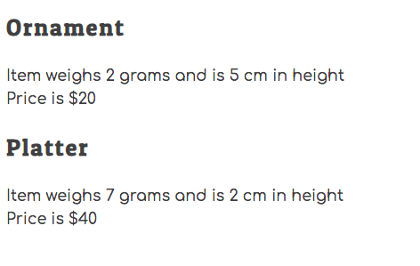

# The Hairy Potter

In this project, your task to build a workflow for making, and firing pottery, and then determining if it should be sold at a craft show. Then you will display the pottery to be sold in the DOM.

> 🧨 Make sure you answer the vocabulary and understanding questions at the end of this document before notifying your coaches that you are done with the project

## Setup

```sh
cd hairy-potter
cd src
code .
```

1. Run the `serve` command to start the web server.
1. Open the URL provided by `serve` in your browser.

## Requirements

### Making Pottery at the Wheel

1. Create a `scripts/PotteryWheel.js` module.
1. Define a variable in the module to have the value of the primary key for each piece of pottery. It should have an initial value of 1.
1. Define and export a function named `makePottery`.
1. The `makePottery` function must accept the following values as input _(i.e. it needs parameters)_, in the following order.
   1. Shape of the piece of pottery (e.g. "Mug", "Platter")
   1. Weight of the piece (e.g. 1, 5)
   1. Height of the piece (e.g. 3, 7)
1. The `makePottery` function must return an object with the following properties on it.
   1. `shape`
   1. `weight`
   1. `height`
   1. `id` _(increment this value each time the function is invoked)_

#### Checking Your Work

In the `main.js` module, invoke the `makePottery` function and provide the required values as arguments. Store the object that gets returned into a variable, and then use `console.log()` to view the object.

Once you have it working, make 5 pieces of pottery in `main.js`.

**THEN PUSH YOUR CODE TO GITHUB**

### Firing the Pottery in the Kiln

1. Define a `scripts/Kiln.js` module.
1. Define and export a function named `firePottery` that is responsible for acting as a kiln.
1. The function must accept the following values as input _(i.e. it needs parameters)_, in the following order. If you don't remember, you can easily [add new properties to objects in JavaScript](https://www.dyn-web.com/tutorials/object-literal/properties.php).
   1. An object representing a piece of pottery that was made at the wheel in the `makePottery` function.
   1. A number specifying the firing temperature of the kiln.
1. The function must add a new property of `fired` with the value of `true` to the object.
1. The function must add a new property of `cracked` to the object.
   1. If the temperature of the kiln is above 2200 degrees then `cracked` property must have a value of `true`.
   1. If the temperature of the kiln is at, or below, 2200 degrees then `cracked` property must have a value of `false`.
1. After both of the new properties have been added, return the augmented object.

#### Checking Your Work

In the `main.js` module, invoke the `firePottery` function for each of the 5 pieces of pottery you created. Ensure you provide the required values as arguments. Store the object that gets returned into a variable, and then use `console.log()` to view the objects and make sure it has the right properties on each.

To check your work, make sure that at least one of your pieces of pottery is fired at a temperature that is too high.

**THEN PUSH YOUR CODE TO GITHUB**

### Pricing Uncracked Pottery

1. Create a `scripts/PotteryCatalog.js` module.
1. Define a variable in the module with a value of an empty array. This array will store pottery that will be sold. Do not export this array.
1. Define and export a function named `toSellOrNotToSell` that is responsible for determining if a piece of pottery should be sold.
1. The `toSellOrNotToSell` function must accept a pottery object as input.
1. If the weight of the piece of pottery is greater than, or equal to, 6 then the function must add a `price` property with a value of 40.
1. If the weight of the piece of pottery is less than 6 then the function must add a `price` property with a value of 20.
1. If the piece of pottery is cracked, do not add a `price` property to it.
1. If the pottery is **not** cracked, add the object to the module-level array of items to be sold.
1. Return the augmented object.
1. Define and export a function named `usePottery` returns a copy of the array of items to be sold. Recall which array method creates a copy of the array.

#### Checking Your Work

In the `main.js` module, invoke the `toSellOrNotToSell` function for each of the 5 pieces of pottery you created. Ensure you provide the required value as an argument.

**THEN PUSH YOUR CODE TO GITHUB**

### Display the Catalog

Your next task is to create HTML representations of the pottery you want to sell at the craft fair and display them on the DOM. Then you will track which ones you sell.

#### Define DOM Target

1. Create an `<article>` element in the `index.html` file.
1. The article element must have a class of `potteryList`.

#### Create Pottery HTML

1. Create a `scripts/PotteryList.js` module.
1. Define and export a `PotteryList` function.
1. The `PotteryList` function must get the items to be sold from the `PotteryCatalog.js` module.
1. The `PotteryList` function must convert each object in the array to an HTML representation string. Use the following template to generate the representations.
   ```html
   <section class="pottery" id="pottery--1">
     <h2 class="pottery__shape">Mug</h2>
     <div class="pottery__properties">
       Item weighs 3 grams and is 6 cm in height
     </div>
     <div class="pottery__price">Price is $20</div>
   </section>
   ```
1. The `PotteryList` function must then return a single string that contains ALL of the pottery HTML representation.

#### Checking Your Work

In the `main.js` module, invoke the `PotteryList` component function. Take its return value and update the inner HTML of the article element you created above. When you start your web server, you should see your non-cracked pottery list appear (_example below_).



**THEN PUSH YOUR CODE TO GITHUB**


## Vocabulary and Understanding

> 🧨 Before you click the "Assessment Complete" button on the Learning Platform, add your answers below for each question and make a commit. It is your option to request a face-to-face meeting with a coach for a vocabulary review.

1. Explain how you got the HTML, with the correct data, displayed in the browser?
   > Your answer here

export const potteryList = () => {

let potteryHTML = "";

let itemsToSell = usePottery();

for(const item of itemsToSell){
potteryHTML += `
<section class="pottery" id="${item.potteryId}">

a) the potteryList function is what creates the HTML representaiton of the pottery items available for sale. It calls usePottery() to get an array of pottery objects that have been marked for sale. That array is stored in a variable called itemsToSell as you can see above as how I defined the for each loop. So the PotteryList function will iterate over each item in the itemsToSellArray. And for each pottery object from the itemsToSellArray we will extract the potteryID, shape of the particular pottery object, height of the pottery object and price of hte pottery object. We will use these values to construct the following HTML template that is formatted by HTML sections. 

<section class="pottery" id="${item.potteryId}">
  <h2 class="pottery__shape">Pottery Shape: ${item.shape}</h2>
  <div class="pottery__properties">
    Item weighs ${item.weight} grams and is ${item.height} cm in height
  </div>
  <div class="pottery__price">Price is ${item.price}</div>
</section>`;

b) as the function will iterate through each item(ie each pottery object) it appends each pottery item's HTML string as a cumulative variable called potteryHTML. When the for loop is complete we will have a single string that consists of the HTML for all pottery items. This is ultimately what will be displayed on the web page. 

c) It is through main.js that we implement the logic to render HTML generated by potteryList.js to be visible on the browser. We first have to instantiate pottery objects with values we pass in via makePottery() method. Using the objects returned from the method call that will instantiate 5 different pottery objects we can then add properties using the firePottery() method to determine whether each pottery object will be fired and if they are cracked. We also call the toSellOrNotToSell() to dictate for each object once we have completed adding all its properties whether it should be sold. Any pottery objects that arent cracked we add a price to them and store via an internal array through toSellOrNotToSell(). finally, we can call potteryList() to generate the HTML string. As we discussed prior potteryList() will retrieve a copy of the array with the pottery objects to sell(let storePottery = []; in PotteryCatalog.js) and iterate through each pottery object and extract the necessary values to fill out the pre defined HTML string.

d) For the HTML rendering:
i) First thing to note is we defined the <article> container where pottery items will be displayed    <article class="potteryList">  </article> and called it the potteryList class 
ii) from there we can easily use a query selector which is part of the DOM API(document object model) and we can use this document.querySelector('.potteryList' to select the article element with the potteryList class. This method returns the FIRST element that matches the selector and in our case we only have 1 potteryList so its a non issue. 
iii) From there we cna tie our main.js file with the index.html which will have the article via document.querySelector('.potteryList').innerHTML = potteryHTML; This innerHTML allows us to set HTML content inside the selected element(article element potteryList class). Via innerHTML the string we generated via potteryList will function as the HTML and serve as the HTML content inside the <article> element. 
iv) Now from doing this the browser can parse the HTML string and render the pottery items on the web page. This is the key part that ties alot of things together. 
v) For specifics on how the browser renders our index.html(which I am writing out and including in this for my own learning sake) the browser will load the index.html in sequential order. So it will parse the <DOCT type html> , <html>, <head> and <body>. At first the <article class="potteryList"> will be empty with no static content ot render. But the browser will eventually encounter /<script src="./scripts/main.js" type="module">/ within the <body> element. Its hte main.js script that will create and process the pottery functions. The main.js script will set the innerHTML of <article> to be the HTML string our potteryList() generated. This will cause the <article> element to update and the browser can detect the change to inner HTML and update the DOM accordingly. So this updated new article element will ahve its new HTML content now parsed and rendered inside with all the values we want. 
vi) Last thing the main.js script file is the entry point that initiates the application. 
A key point I did not know and had to adjust to get this to work <script src="./scripts/main.js" type="module"></script> was to include type = "module". This attribute indicates the script is a module and can use import and export statements. This is crucial because main.js has to import functions needed to create and process pottery objects(ie PotteryWheel.js, Klin.js etc) so we need to import functions from those modules. 


2. In the **PotteryList** module, when you iterate your pottery, you need to show the evidence of what the **weight** property's value is for the 2nd piece of pottery. Use [Loom](https://www.loom.com/) to record your browser window with the developer tools open and show those values.

Hre is the link for no 2: https://www.loom.com/share/e1bb644ddd3842e993c2d5f409fd3825?sid=b6ecc857-c851-44b6-8ac3-99dd10dcdc38


   > Paste your video's public URL here
3. The **PotteryWheel** module has a single function named `makePottery`. Why doesn't that module have all of the other code in it?

This just comes down to the idea of modularity which is breaking down code into smaller self contained modules so each module can address a separate concern. Especially for a small project like this its good practice to try to keep a module to having only a single overall resposibility. In this case the makePottery() of potteryWheel has the sole focus of creating pottery objects. Any other module that needs to call this function can simply import it via import { makePottery } from './PotteryWheel.js';. 

Maybe the most obvious benefit of this is being able to reuse code without having to duplicate it. If you later want to make changes to how you implement the logic for makePottery(), those changes can be confined to the PotteryWheel.js module and not affect other parts of the application. If you didnt modularize PotteryWheel.js and copied its logic across many different parts of the app, if you need to tweak the logic you could easily forget one place where you used the method and wrote out the logic. 

Modules may need to interact with each other, the export and import statements make this kind of interdependence easy to manage. You can include functions, objects or variables via an import statement as long as they have been exported from another module. 


   > Your answer here
4. The pottery shop has learned that there is a set of customers that are willing to buy cracked pottery at a discounted price of $2.50. That means that the cracked pottery should now be displayed in the catalog. Explain the changes that this new business strategy would cause to your algorithm.

The change will come in the PotteryCatalog. The firePottery function will continue to determine if the pottery is cracked and set the appropriate properties it wont need to be changed in the Klin.js 
As for the toSellOrNotToSell() function in PotteryCatalog.js this is our current logic 

export function toSellOrNotToSell (potteryObject) {

    if(!potteryObject.cracked){
    if(potteryObject.weight > 6){
        potteryObject.price = 40;
    } else {
        potteryObject.price = 20;
    }
    storePottery.push(potteryObject);
}

return potteryObject;

}

what we need to change is the logic from our if statements. We can start out by checkign if potteryObjects are cracked. If they are all we need to do is set the price to 2.50 and we can return that value. If it is not cracked then that can be the else condition of this if statement and we can use the same logic as above. In fact I can shorten it a bit for brevity and practice using javascript synthax 

export function toSellOrNotToSell(potteryObject) {
    if (potteryObject.cracked) {
        potteryObject.price = 2.50;
    } else {
      potteryObject.price = potteryObject.weight >= 6 ? 40 : 20;
    }
    storePottery.push(potteryObject);
    return potteryObject;
}

since storePottery includes cracked pottery the potteryList function will generate HTML for these items and be incldued in our HTML string that ultimately gets rendered by the browser. If you wanted to 
potteryHTML += `
<section class="pottery" id="${item.potteryId}">
  <h2 class="pottery__shape">Pottery Shape: ${item.shape}</h2>
  <div class="pottery__properties">
    Item weighs ${item.weight} grams and is ${item.height} cm in height
  </div>
  <div class="pottery__price">Price is ${item.price}</div>
</section>`;
}
you could include an HTML to display whether the individual pottery object was cracked. 
To make it more logical define a variable within your for loop like const crackedStatus = item.cracked ? "yes" : "no"; and use that variable in an extra div element you create. 
 <div class="pottery_cracked" Is this pottery cracked ${crackedStatus}</div>

how it might look overall 
      const crackedStatus = item.cracked ? "Yes" : "No";
        
        potteryHTML += `
            <section class="pottery" id="pottery--${item.id}">
                <h2 class="pottery__shape">${item.shape}</h2>
                <div class="pottery__properties">
                    Item weighs ${item.weight} grams and is ${item.height} cm in height
                </div>
                <div class="pottery__cracked">
                    Is this pottery cracked? ${crackedStatus}
                </div>
                <div class="pottery__price">Price is $${item.price}</div>
            </section>
        `;
    }


   > Your answer here

   https://www.loom.com/share/a8b794926bad4be6a054ea58af73b037?sid=76e6494e-aa8e-4e93-87d8-2309be5ed584
   this is for question 5 hte link 
5. In the **Kiln** module, you have a `firePottery()` function. You need to demonstrate how to use the debugger to verify the values of the parameters for that function when your code runs. Use [Loom](https://www.loom.com/) to record your browser window with the developer tools open and show those values.
   > Paste your video's public URL here
